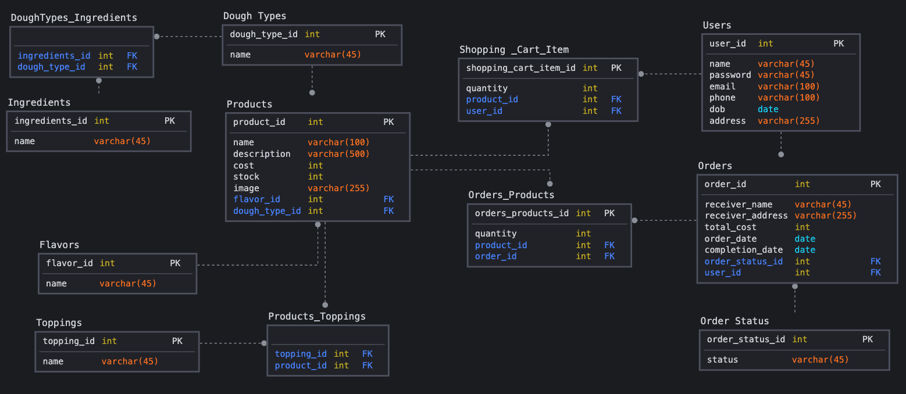
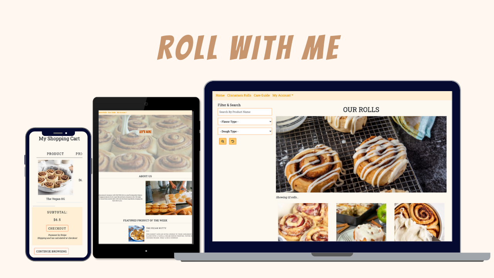
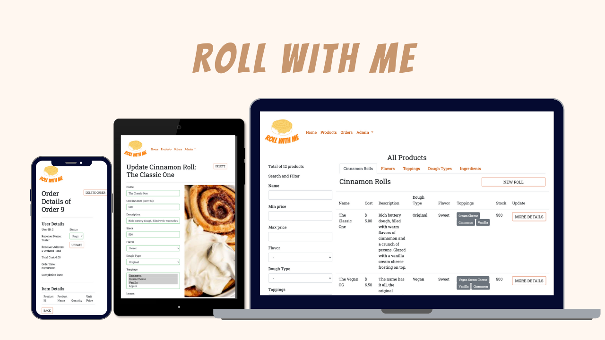

# Roll With Me

This project aims to create a full-stack application which has the following features:
* Database Migrations (with Bookshelf)
* ORM
* Form Helpers and Validations
* User authentication 
* Routing

This web application can serve the following purpose: 
* Ecommerce platform for users to search, read and buy cinnamon rolls.
* Vendor platform for admin to conduct CRUD on cinnamon roll products, stock and orders.

## Context
Site Owner's Goals: This project aims to create an interactive web application using ReactJS and Express to create a full-stack application.
* Create an online payment and integrate a third-party payment gateway with Stripe
* Have content or features that are accessible by users through authentication
* Create a single page application using React Hooks and use HTTP requests to consume endpoints

## Express and Access

Github to the Backend URL: https://github.com/mjpong/project3-bakery-be

Live Admin Site URL: https://mjp-tgc12-project3.herokuapp.com/

Live Consumer Site URL: https://rollwithme.netlify.app/ 

## Justification
The purpose of this website is for potential home business owners / bakers to see what an ecommerce website would look like in the consumer as well as admin side. As most businesses are moving online and not in an actual shop, it is a platform for consumers who want to buy cinnamon rolls (or pastries) online.

# Strategy
## Identifying External Users

As previously mentioned above, there are two primary users for this project.
* Consumers who want view different cinnamon roll products and purchase them
* Vendors who want to be able to manage their cinnamon roll products and orders

## User Stories

| User Stories | Acceptance Criteria |
| ------------ | ------------------- |
| Want to be able to have a platform where I can view all products and images | User friendly browse page for consumers to view all products and details |
| It would be nice to be able to have a straight forward website where there is a easy to use shopping cart | Web app where users are able to update and add items to cart after signing into their account |
| Want a platform to be able to showcase my products that I bake at home and would want to start selling | Platform for potential home business owners to bring their products online to be able to share with the community |
| Never know how to organize payment details or how it works | Payment system will be implemented into the website through Stripe therefore payment will be done on a secure platform and not on the admin's webapp |
| Have a platform but don't know how to incorporate a user profile and passwords into it | Through user authentication, passwords will be hashed and users will be able to sign in and retrieve previous orders and check their shopping cart |
| Orders are made for my business but I want a platform to be able to track them | Admin would be able to track and update orders accordingly, can change to order delivering or order success |

## Vendor User Goals and Mandatory Requirement
1. CRUD on all products, ingredients, doughtypes, toppings, flavors
2. Search filter to see if a cinnamon roll exists in the database
3. CRUD on all orders in backend made by consumers in the front end
4. Users are able to create an admin / vendor account only, view profile and edit account details

## Consumer User Goals and Mandatory Requirement
1. View all products - cinnamon rolls
2. Search filter to see if a cinnamon roll exists in the product list
3. See basic information and details on the chosen cinnamon roll such as ingredients and toppings used to bake the product to ensure dietary restrictions
4. Users are able to create a consumer account only, view their profile and edit their profile details 
5. Able to add products to a shopping cart
6. Delete or change quantity of cinnamon rolls in shopping cart
7. Check out and pay for their items from shopping cart
8. View and track their individual order made

### Optional Requirement
1. User roles are separated that admin / vendors are only able to access the backend, and consumers are only able to access the front end
2. Orders are able to be sent to a different name and address (perhaps as a gift) instead of based on the users own details
3. Stripe checkout is done in React
4. Order status can be changed by admin via backend based on payment pending, success, delivering and completed
5. Image upload platform is done by Uploadcare instead of Cloudinary

# Scope / UIUX
## Functional Requirement
1. MySQL Database to hold all the require information.
2. Display proficiency in React Hook, MySQL, Express and NodeJS
3. Provide two platforms to fulfil both consumer and admin user goals
4. Integrate features such as 
    * ORM
    * Database Migration 
    * Caolan Form Helpers and Validation 
    * Image Uploader
    * User Authentication 
    * Routes and Routing
5. Integrate third party payment gateway
    * Stripe

## Non-Functional Requirement
1. Performance
2. Readability

# Structure and Features
## Content Information
This information is necessary to fulfil all the mandatory content requirement, the information will be repeated and shared across different pages. This is all based on the Logical Schema Diagram created for this project.

  

## Navigation
Navigation between different elements can also be done using the nav bar provided at the top, or through the links on the footer. The links are changed based on if the user is logged in or not.

## Consumer Front End
  

### Landing Page and Care Guide
1. Solid hero image that leads to the product pages
2. About us description that gives customers an insight and background to the business
3. Featured product of the week that can be presented in the landing page to show off to the customers
4. Care Guide is a user guide for customers who might want to save some cinnamon rolls for the next day and how they should proceed

### Browse and View Product
1. Search filter products
    * Product names can be searched and it is not case-sensitive
    * Flavors and Dough Types can be filtered for dietary restrictions 
2. Product listing
    * All the products that is provided for users to choose and add to cart
3. Product details
    * Specific details such as if there is stock available, what ingredients were used to make the specific product that was clicked
4. Reheating instructions
    * Reminders for users who might want to reheat it and different ways to do it
5. Add to shopping cart
    * Users must be logged in in order to click "add to cart" in the detailed product page

### Shopping Cart
1. Empty cart image will be shown user has not added anything in the shopping cart
2. Table in the shoppping cart to list all the products, price, quantity, total price, subtotal
3. Users are able to edit the quantity of the products in this page, increase and decrease quantity as well as delete the item from the shopping cart
4. Users are one click away to head to checkout to Stripe for payment
5. After entering payment details in Stripe, users are redirected back to their account's order page where they can view that specific order details 

### Orders
1. All of the specific user's orders are listed in a table, ordered by the most recent on top
2. Order status are listed to show customer the progress of their orders, what is already completed as well
3. Order details show the receiver name and address, the product table lists in the same structure as the shopping cart

### User Profile
1. User's profile page shows their information that they entered while creating their account
2. When editing their profile, user's details already filled out in the form except their password while must be filled in again due to security reasons
3. Users that were created on the customer site are not able to view the admin site
4. Email addresses are used as 'usernames' and cannot be repeated

## Admin Back End
  
### Products
1. List and details of all that Roll With Me offers:
    * Products
    * Flavors
    * Toppings
    * Dough Types
    * Ingredients
2. CRUD on all of the above
3. Search function for all product names that are not case sensitive
4. Filter function for all the other categories such as flavor and dough type only

### Orders
1. List and details of all the orders made by every user on the customer side
2. CRUD on Customer's Order details
3. Under more details admin user can update the order status if, payment pending, payment successful, order in delivery or if the order has been delivered and completed
4. Search and filter functions for all orders and receiver names that are not case sensitive

### User Profile
1. User's profile page shows their information that they entered while creating their account
2. When editing their profile, user's details already filled out in the form except their password while must be filled in again due to security reasons
3. Users that were created on the admin site are not able to view the customer site
4. Email addresses are used as 'usernames' and cannot be repeated

## Form-validation
As this is part of the project goal, conditional rendering and flags has been implemented to both the consumer and user side forms to make sure the form inputs by users are in the correct format. The conditional rendering will show the user which fields are unacceptable and provide context to it. 

## Mobile Responsive
All the elements in this one page web application is responsive across various devices, the component will automatically arrange itself based on the screen size:
* Laptop - landscape mode
* iPad / Tablet - landscape / portrait mode
* iPhone / Smart Phone - portrait mode

## Limitations and future implementations
Some future implementations that I would like to add to this web application: 
1. Insert built in tags to migration that would be set
2. Payment failed, what if user want to pay again
3. Admin roles add a delivery vendor who cannot edit products 
4. Admin roles can deactivate users
5. DOB is tough to scroll down if year is not close to the current year, see if there any css changes
6. Feature product that rotates on random each week or a function in the backend for admin to change
7. If shopping cart is empty, users cannot click on checkout button 

# Surface
## Color
  
This color scheme was put together by [canva](www.canva.com) and is used for the main theme for the whole web page.
This is the main color scheme of the logo as well as the landing page. For the other pages, it is shown on borders of the buttons and search fields, background to keep it clean and easy for users to read.

## Typography
* Bangerz font is used for the header and logo for the text of the webpage. 
* Roboto Slab font is used for the body of the text in the webpage. The font gives off a very strong and classic sense and supports the whole base of the web app. 
* Font size is set to adjust according to the different device size, easier to read and understand.

## Icons
FontAwesome icons were used in the footer and search filters in order to show a contrast from just the words and to give a different style in the web page.

# Testing
## Functionality Testing 

## Testing User Accounts
**Please make sure that after all testing is done, that the user details are reverted to the original.**
**Especially if the password has been updated, please change it back.**
If there are any errors and password cannot be reverted back to original, please reach out to let me know.

|Category |Email Address | Password |
|:---------|:----------------------|:---------------------|
|Customer Side  | tester@rollwithme.com | testing123 |
|Admin Side | admin@rollwithme.com | admin123 |

## View and Search Filter - Consumer & Vendor Side (CS & VS)
|Category |Input/Actions/Items | Output/Errors |
|:---------|:----------------------|:---------------------|
|Overall CS | On Load | All products should be shown with name and price |
|Overall VS | On Load | All products should be shown with name and category tags, other categories are also shown in the tabs |
|Filter & Search Bar | Typing into "Search by Product Name" | The space will capture the text, and will not be searched until clicked search |
|Filter & Search Bar | Search criteria | Product names only can be searched, flavor or price or dough types do not work |
|Filter & Search Bar | Search criteria | Product names are not case-sensitive |
|Filter & Search Bar | On click | Same layout of products showing, but just the ones with the words in the name of product |
|Search Bar | Typing into "Search By Product Name" | After searching, if the text area is cleared and search button is clicked again, it shows all results |
|Search Bar | Search criteria | Search results show for entries with the full or partial name in it, e.g. "pecan" or "pecan party" shows "The Pecan Party" product |
|Search Bar | Search criteria | There are results for "sweet" as it is in a product name, and it is not searching as a flavor |
|Search Bar VS | Price Search criteria | Results for different price shown even if it is just the min or max that is filled in |
|Filter Search | Filter Flavor | Drop down will change to the selected flavor |
|Filter Search | Filter Dough Type | Drop down will change to the selected dough type |
|Filter Search VS | Filter Toppings | Drop down will change to the selected topping |
|Filter Search | All 3 criteria met | Items will search with 3 criteria, or just 2 criteria, or just 1 as well when search is clicked|
|Reset Button | On Click | Resets all criteria and shows all cinnamon rolls again|

## Shopping Cart and Checkout - Consumer Side
|Category |Input/Actions/Items | Output/Errors |
|:---------|:----------------------|:---------------------|
|Shopping Cart | On Load | "Your cart is empty" image if there are no items in the cart |
|Shopping Cart | On Load | Items are listed out in the table, according to the correct headers |
|Shopping Cart | Quantity Count on Increase | Whenever the add btn is clicked, one quantity is added, the total price and the subtotal also changes accordingly |
|Shopping Cart | Quantity Count on Decrease | Whenever the minus btn is clicked, one quantity is decreased, the total price and the subtotal also changes accordingly |
|Shopping Cart | Total / Subtotal | Total and subtotal is different according to the quantity of the products |
|Continue Browsing| On Click | Brings customers back to the products browse page to continue to add to cart |
|Checkout | On click | When clicked, leads the customer to a "Name and Address" page which they can fill in a name and address that is not theirs if this is a gift or delivery for someone else | 
|Stripe Checkout | Payment | After payment is done and completed, users are sent back to their orders page with a "successful" or "unsuccessful" message based on payment |

## Orders - Consumer & Vendor Side (CS & VS)
|Category |Input/Actions/Items | Output/Errors |
|:---------|:----------------------|:---------------------|
|Order Page CS |Order Listing | The orders of the specific are listed from the most recent to the bottom, if no completed date, it will show "in progress" |
|Order Page CS |Order Details | Same layout as shopping cart for the products details, rendered |
|Order Page VS |Order Listing | All orders of all users are listed from most recent, status is shown instead of progress |
|Order Page VS | Filter and Search Bar | Receiver names are not case-sensitive for search |
|Order Page VS | Filter Order Status | Drop down will change to the selected status |
|Order Page VS | Search Bar | Order ID, User Id, Cost all will be shown and results shown per criteria |
|Order Page VS | Update Order Status | Order status can be updated accordingly, if order status changed to completed, then date will be set to the same date |
|Order Page VS | Delete Button | Order will be deleted off the database, gone from customer's side as well |

## Profile Page - Consumer & Vendor Side (CS & VS)
|Category |Input/Actions/Items | Output/Errors |
|:---------|:----------------------|:---------------------|
|Create Account| Form Validation | Password must be 8-20 characters |
|Create Account| Form Validation | Error message shows if confirm password is not the same as password|
|Create Account| Form Validation | If form is left empty, form validation messages will show and not allow to create |
|Profile Page| On load | Users information that they have filed in while creating account |
|Update Account| On load | Same create account form with user's details filled in form |
|Update Account| Form Validation | Same validations will show if filled in the form incorrectly as create account |
|Create and Update Account| Successful Creation / Updating | Will redirect users to re-login to make sure the password is correct|

## Mobile Responsive - Consumer & Vendor Side (CS & VS)
|Category |Input/Actions/Items | Output/Errors |
|:---------|:----------------------|:---------------------|
| Navbar | Nav items | Move to a collapsable div when mobile responsive | 
| Product Listing CS | Product Images | Bootstrap columns are added for product images to show it mobile responsively |
| Product, Order Listing VS | Tables | Responsive tables for orders and products so all information can be shown |
| Shopping Cart CS | Tables | Responsive tables to show products for shopping cart |
| All images CS | Images | All images are adjusted smaller when on a smaller size screen |

# Technologies Used
* HTML
* CSS
* Javascript
* ReactJS
* [Bookshelf](https://bookshelfjs.org/) for ORM
* [axios](https://github.com/axios/axios) for API
* [Caolan-Forms](https://github.com/caolan/forms)
* [Db-migrate](https://github.com/db-migrate) for database migration
* [Stripe] (https://stripe.com/en-sg) for payment
* [Uploadcare] (https://uploadcare.com) for image hosting

Other technologies: 
* CORS
* csurf
* jsonwebtoken
* hbs
* wax-on
* knex
* express
* connect-flash
* db-migrate-mysql
* db-migrate-pg
* pg

For styling:
* [Bootstrap](https://getbootstrap.com) for main layout design, navbar, create form
* [Fontawesome](https://fontawesome.com/) for the different icons
* [Canva](https://www.canva.com) for the color theme and the mockup images for different devices, and to create a logo
* [Google Font](https://fonts.google.com/) for the font scheme

For deployment: 
* [Github] (https://github.com)
* [netlify](https://www.netlify.com) to deploy react application
* [heroku](https://www.heroku.com) to deploy express application

# Deployment
### React:
This web app is hosted by Netlify.
[TGC's react deployment guide](https://docs.google.com/document/d/1cquGsm1x8Tm2vzcJcAxQdnCe_BxF9b9z34vQEJ6-K7E/edit)
Data sets are store in Heroku and are called automatically. It may take up to thirty seconds for data set to be loaded. 
Apart from React default package. Ensure you have the following depencencies. 
* axios
* bootstrap
* react-router-dom

Steps for deployment:
1. All edits were added, commited, and pushed to GitHub via Gitpod.
2. In the terminal, type `yarn build`
3. Download the build folder to desktop.
4. Go to https://www.netlify.com/ and log in with Github account.
5. Click on "Sites" button.
6. Drag the entire folder "build" to the box in sites. 
7. Click on "Deploy site" button to get a link for the deployed site.

### Express:
This express side is hosted by Heroku. 
[TGC's express deployment guide cropped from original lab](https://docs.google.com/document/d/1-O-m7KGG_8GrKb0QwuuVRI9iGk_xmE8mMyqR0w_2JVs/edit) 
**Steps for after deployment:**
1. Make sure all the BASE_URLs that were used in both front end and back end are all updated to ensure a smooth web app.

## Credits
* [pexels](https://www.pexels.com) for the banner images
* Deployed React with build through instructions from [TGC's react deployment guide](https://docs.google.com/document/d/1cquGsm1x8Tm2vzcJcAxQdnCe_BxF9b9z34vQEJ6-K7E/edit), put together by Paul Chor.
* Deployed express to Heroku through instructions cropped from [TGC's express deployment guide](https://docs.google.com/document/d/1B0JsUbarBXfJmHxi2ydC1722-JjbKEZ_3rQwMGyl2AI/edit?usp=sharing), put together by Paul Chor.